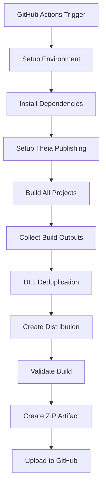

# Downscaler Build System Documentation

This document describes the comprehensive GitHub Actions build system for the Downscaler multi-project repository.

## Overview

The build system automatically builds all projects in the repository, deduplicates shared DLLs, organizes outputs into a unified distribution structure, and creates a downloadable zip artifact. It's designed specifically for Windows x64 builds and handles the complexity of mixed C#, C++, and JavaScript/TypeScript projects.

## Architecture



## Project Categories

### Applications (Main User Software)
- **Downscaler**: WinUI application for display scaling
- **GameLauncher**: Console application with scripting support
- **ScriptEditor**: Eclipse Theia-based script editor (Electron)

### Utilities (System Tools)
- **DiagnosticWindow**: Native diagnostic utility
- **IdentifyMonitorsUtil**: Monitor identification tool
- **MonitorFadeUtil**: Monitor fade control utility

### Libraries (Native Components)
- **Downscaler.Cpp.Core**: Core C++ library
- **Downscaler.Cpp.WinRT**: WinRT components
- **Cpp.Core**: Base C++ library

### Build Tools (Development)
- **GameLauncherTaskGenerator**: Code generation utility
- **YamlSchemaTypes**: TypeScript type definitions
- **TypeScriptCompiler**: TypeScript compilation tools

## Build Scripts

Located in the [`build-scripts/`](build-scripts/) directory:

### [`setup-theia-publish.js`](build-scripts/setup-theia-publish.js)
- Configures Eclipse Theia (ScriptEditor) for publishing
- Adds required npm scripts and electron-builder configuration
- Updates both `package.json` and `.esproj` files

### [`collect-outputs.js`](build-scripts/collect-outputs.js)
- Discovers and collects build outputs from all projects
- Implements intelligent DLL deduplication using SHA-256 hashes
- **Errors on hash mismatches** to prevent DLL hell
- Generates detailed build report with DLL manifest

### [`create-distribution.js`](build-scripts/create-distribution.js)
- Organizes outputs into logical category structure
- Creates shared DLL directory with reference files
- Generates README files and launcher scripts
- Produces user-friendly distribution layout

### [`validate-build.js`](build-scripts/validate-build.js)
- Validates distribution structure integrity
- Checks for required executables and configuration files
- Verifies build report and DLL deduplication results
- Generates comprehensive validation report

## Distribution Structure

```
dist/
├── Applications/           # Main user applications
│   ├── Downscaler/
│   ├── GameLauncher/
│   └── ScriptEditor/
├── Utilities/              # System utilities
│   ├── DiagnosticWindow/
│   ├── IdentifyMonitorsUtil/
│   └── MonitorFadeUtil/
├── Libraries/              # Native libraries
│   ├── Downscaler.Cpp.Core/
│   ├── Downscaler.Cpp.WinRT/
│   └── Cpp.Core/
├── BuildTools/             # Development tools
│   ├── GameLauncherTaskGenerator/
│   ├── YamlSchemaTypes/
│   └── TypeScriptCompiler/
├── Shared/                 # Shared components
│   └── DLLs/              # Deduplicated DLL files
├── README.md              # Main distribution documentation
├── launcher.bat           # Interactive application launcher
├── utilities.bat          # Utilities menu
└── validation-report.json # Build validation results
```

## DLL Deduplication Strategy

### Hash-Based Identification
- Calculates SHA-256 hash for every DLL file
- Maintains registry of DLL name → hash mappings
- Skips identical DLLs (same name, same hash)

### Error Handling
- **Fatal Error**: Same DLL name with different hashes
- Prevents runtime conflicts and dependency issues
- Provides detailed mismatch information for debugging

### Shared vs Project-Specific
- **Shared DLLs**: System libraries (Microsoft.*, System.*, etc.)
- **Project-Specific**: Application-unique DLLs and resources
- Uses `.ref` files to reference shared DLLs from project directories

## Caching Strategy

### NuGet Package Cache
- Caches `~/.nuget/packages`
- Key: Hash of all `.csproj` and `.vcxproj` files
- Significantly reduces restore time

### Node.js Module Cache
- Caches all `node_modules` directories
- Key: Hash of `yarn.lock`, `package-lock.json`, and build script `package.json`
- Includes build script dependencies

## Workflow Triggers

- **Push**: `main` and `develop` branches
- **Pull Request**: Targeting `main` branch  
- **Manual**: `workflow_dispatch` for on-demand builds

## Environment Requirements

- **Runner**: `windows-2022`
- **Platform**: Windows x64
- **Configuration**: Release
- **.NET SDK**: 8.0.x
- **Node.js**: 18.x
- **MSBuild**: Latest (via `microsoft/setup-msbuild@v2`)

## Artifacts

### Primary Artifact
- **Name**: `downscaler-build-{sha}`
- **Content**: Complete distribution ZIP
- **Retention**: 90 days
- **Compression**: Pre-optimized (level 0 in upload)

### Debug Artifacts (On Failure)
- **Build Report**: `build-report-{sha}` (30 days)
- **Validation Report**: `validation-report-{sha}` (30 days)

## Error Handling

### Build Failures
- MSBuild errors terminate the workflow
- Test project is excluded but other build failures are fatal
- Build report uploaded on failure for debugging

### Validation Failures
- Distribution structure validation
- Missing executables or configuration files
- DLL hash mismatch errors
- Validation report always uploaded

### Script Failures
- Each Node.js script includes comprehensive error handling
- Process exits with appropriate codes (0 = success, 1 = failure)
- Detailed error messages and context provided

## Usage

### Triggering a Build
1. **Automatic**: Push to `main` or `develop`, or create PR to `main`
2. **Manual**: Go to Actions tab → "Build All Projects" → "Run workflow"

### Downloading Results
1. Navigate to the workflow run
2. Download the `downscaler-build-{sha}` artifact
3. Extract the ZIP file
4. Run `launcher.bat` for interactive menu

### Local Testing
```bash
# Install build script dependencies
cd build-scripts
npm install

# Run individual scripts
node setup-theia-publish.js
node collect-outputs.js
node create-distribution.js
node validate-build.js
```

## Troubleshooting

### Common Issues

1. **DLL Hash Mismatch**
   - Check build report for conflicting DLLs
   - Verify project references and versions
   - May indicate dependency version conflicts

2. **Missing Build Outputs**
   - Check MSBuild configuration and platform settings
   - Verify project builds individually
   - Review build paths in `collect-outputs.js`

3. **Theia/ScriptEditor Issues**
   - Check `setup-theia-publish.js` execution
   - Verify Yarn and Node.js versions
   - Review Electron build configuration

4. **Validation Failures**
   - Check `validation-report.json` for details
   - Verify expected executables exist
   - Review distribution structure

### Debug Information
- Build logs available in GitHub Actions interface
- Validation report provides detailed analysis
- Build report includes DLL manifest and deduplication stats

## Future Enhancements

- Support for ARM64 builds
- Incremental build optimization
- Cross-platform support (Linux/macOS)
- Enhanced caching strategies
- Parallel build execution
- Automated testing integration

## Security Considerations

- All build scripts run in isolated GitHub Actions environment
- No secrets or credentials required for public repositories
- DLL hash verification prevents tampering
- Artifact retention policies limit storage exposure

---

For technical support or questions about the build system, please refer to the GitHub Issues or contact the development team.